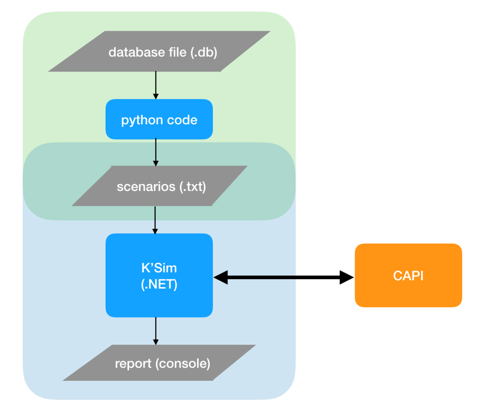

# Automation Testing

CAPI is a software under testing, a questionnaire in form of desktop application. Depending on the preset values of each user and the answers during the questionnaire scenarios differ from each other. That is why we have different scenarios to test.

